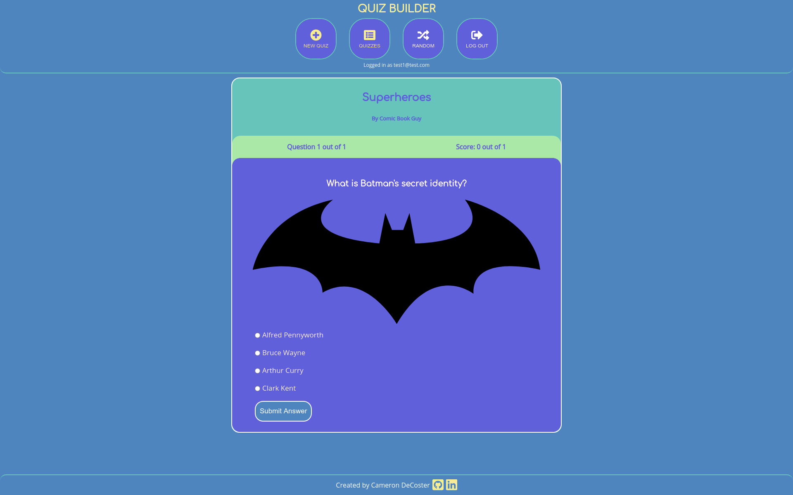

# [Quiz Builder](https://quiz-builder-client.vercel.app)

Quiz Builder is a site that helps you create simple multiple choice quizzes and share them with your friends. To get started, create an account and build your first quiz! Each quiz can have up to 20 questions and each question can have up to 8 answer choices.

While building a quiz, you'll be able to:

-   Give the quiz a catchy title
-   Add a quiz description
-   Edit a question you've already saved
-   Set the order of the questions

After you're done, share the quiz URL with anyone you want to take it. Do you want someone to start in the middle of the quiz? Just give them the question URL and they can start the quiz at that point. All quizzes will be public, so anyone can take them. Are you feeling lucky? Click the random quiz button and try someone else's quiz.

Features that will be added in the future:

-   Choose a color theme for the quiz and questions
-   Add an image URL to the quiz and questions
-   Random question order

[Quiz Builder](https://quiz-builder-client.vercel.app) is built using React for the frontend and Node/Express/PostgreSQL for the [backend](https://github.com/camdecoster/quiz-builder-api). Give it a try and let me know if you have any [feedback or suggestions](https://github.com/camdecoster/quiz-builder-client/issues) on the client.
